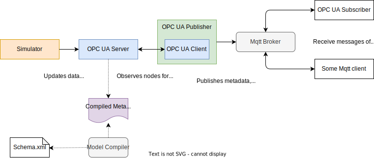

# OPC UA example

This is a simple OPC UA server, client, publisher and subscriber network example using C#/.NETv8 and the [OPC Foundation SDK](https://github.com/opcfoundation).
It also contains a custom [OPC UA model](src\OpcUaServer\OpcUaModel\HarnessMachine\MachineModel.xml), written in XML and compiled with the [UA-ModelCompiler](https://github.com/OPCFoundation/UA-ModelCompiler).

## How to run the example

1. Open `OpcUaDemo.sln` with Visual Studio 2022
2. Set `SimulationHost` as startup application
3. Get the connection details to your MQTT broker
4. Modify the MqttCommon/Config.cs (broker host/port)
5. Run the example

## Additional tools

To get some insights of the OPC UA server, use a OPC UA browser like [Prosys OPC UA Browser](https://downloads.prosysopc.com/opc-ua-browser-downloads.php) (there are many others).

To watch the mqtt stream, use a Mqtt client, such as [MQTT.fx](https://www.softblade.de/).

## Links

- [OPC Foundation](https://opcfoundation.org/)
- [OPC Foundation on GitHub](https://github.com/OPCFoundation)
- [UA-ModelCompiler](https://github.com/OPCFoundation/UA-ModelCompiler)
- [UA-IIoT-StarterKit](https://github.com/OPCFoundation/UA-IIoT-StarterKit)
- [Interview with Tim Bourke, founder of OPC, former president](https://www.iiot.university/podcasts/4-0-solutions-podcast/episodes/2148697477)
